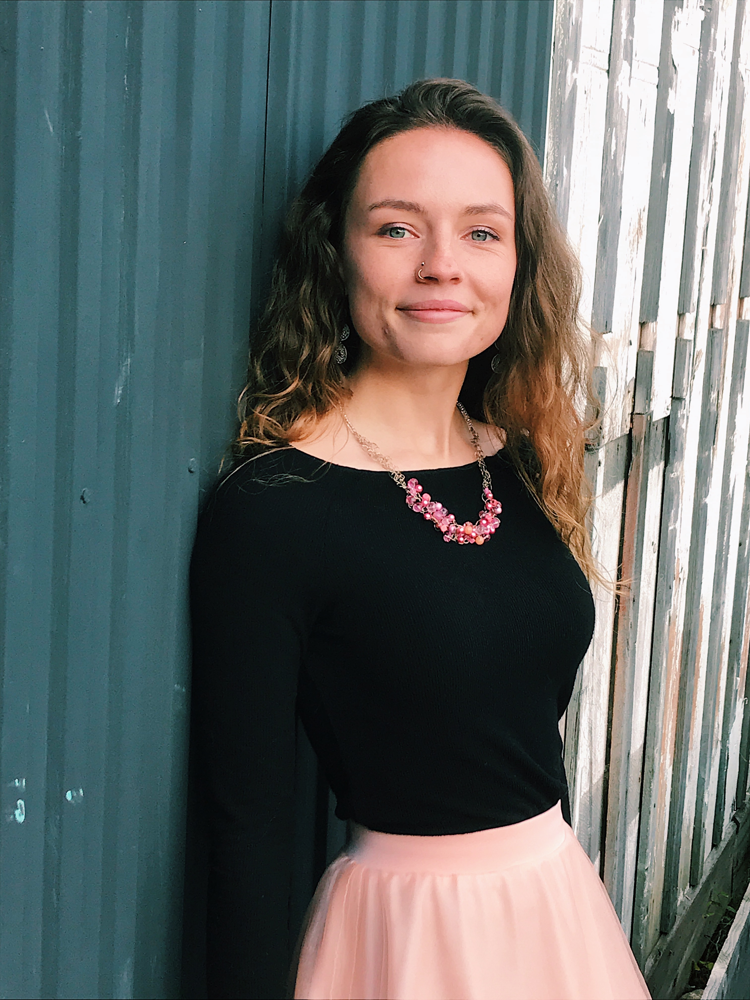

I am currently a full-time student working towards my Masters Degree in Data Science and Analytics at Grand Valley State University. My bachlors is in Mathematics from Kalamazoo College with a minor in Environmental Science. 

Within the realm of data science and analytics I am looking for a career that will provide opportunites to be creative within the analytics process. I like project that have technical and creative elements, such as building this website. I am also very passionate about the environment and specifically food systems, and ways in which we can change our diet for our health but also our community and planet.

I have included my resume below. 

## [LinkedIn Profile](https://www.linkedin.com/in/carley-dziewicki-4140321b8/)
## [Undergraduate Thesis](https://cache.kzoo.edu/handle/10920/38630)

 <iframe src="ResumeCDziewickiR.pdf" width="100%" height="500px">
    </iframe>